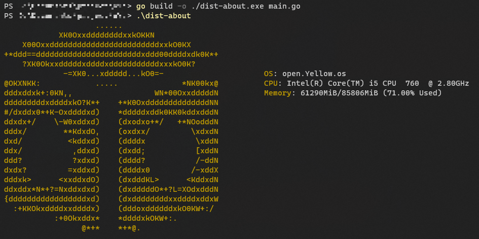

# open.Yellow.os dist-about

This command is such as [neofetch](https://github.com/dylanaraps/neofetch).

# How to build and use

## Build

1. Plase clone this repository.

2. Run this command. 

```bash
go build -o ./dist-about main.go #Linux

go build -o ./dist-about.exe main.go #Windows
```

**`aa.txt` must be in the same directory.**

## Use

```bash
./dist-about #Linux

.\dist-about #Windows
```

**If PATH is passed, only the command name can be used.**

